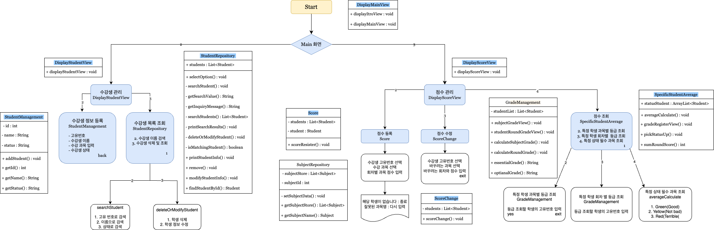

## 수강생 관리 프로그램

이 프로젝트는 캠프 관리 시스템을 위한 요구사항 및 기능 명세서를 바탕으로 개발하였습니다. 
 해당 시스템은 수강생 관리, 과목 관리, 점수 관리 기능을 포함하여 캠프 관리자와 수강생 간의 효율적인 상호작용을 목표로 합니다.

---
## 팀원 소개

- 박예서
  - 팀 리더
  - 수강생 삭제 기능
  - 수강생 목록 조회
  - 수강생 정보 등록 UI
  - 수강생 Repository 구현

   

- 문정석
    - 메인 로직 구성
    - 과목 Repository 구현
    - 수강생 점수 입력 및 저장 기능
    - 특정 학생 회차 별 등급 조회
    - 점수별 등급 환산 기능

   
  
- 박용준
  - 전체적인 점수 계산 로직 담당 
  - 특정 상태의 필수 과목 평균 등급 산출 기능
  - 점수별 등급 환산 기능

     

- 권이슬
    - 메인 메뉴 뷰 구현
    - Flow Chart 작성
    - 테스트 케이스 실행 및 오류 검출

   

- 정예지
    - 수강생 정보 등록 기능
    - 수강생 수정 기능
---

## 요구 사항 정의

캠프에는 필수 과목과 선택 과목이 존재하며, 수강생은 최소 3개의 필수 과목과 2개의 선택 과목을 선택해야 합니다.

### 필수 과목 목록
- Java
- 객체지향
- Spring
- JPA
- MySQL

### 선택 과목 목록
- 디자인 패턴
- Spring Security
- Redis
- MongoDB

### 조건
- 최소 `3개 이상`의 `필수 과목`과 `2개 이상`의 `선택 과목`을 선택해야 합니다.
- 캠프 기간 동안 선택한 과목별로 `총 10회`의 시험이 치러집니다.
- 캠프 매니저는 수강생의 과목과 시험 점수를 `등록 및 관리`할 수 있습니다.
- 점수 데이터 타입은 정수형이며, `점수에 따라 등급`이 매겨집니다.

---
## 기능 명세서

### 필수 요구 사항

#### 1. 수강생 관리
- **수강생의 고유번호는 중복될 수 없습니다.**
- 수강생 정보를 등록할 수 있습니다:
    - 고유 번호
    - 이름
    - 과목 목록
- 수강생 목록을 조회할 수 있습니다:
    - 고유 번호
    - 이름

#### 1. 수강생 상태 관리
- 수강생의 상태를 관리할 수 있습니다:
    - 상태 종류: Green, Red, Yellow
- 수강생 정보를 조회할 수 있습니다:
    - 고유 번호, 이름, 상태, 선택한 과목명
- 수강생 정보를 수정할 수 있습니다:
    - 이름 또는 상태 정보 수정 가능
- 상태별 수강생 목록을 조회할 수 있습니다:
    - 고유 번호, 이름
- 수강생 삭제 기능:
    - 해당 수강생의 점수 기록도 함께 삭제됩니다.

#### 2. 점수 관리
- 수강생의 과목별 평균 등급을 조회할 수 있습니다:
    - 과목명, 평균 등급

- 특정 상태의 수강생들의 필수 과목 평균 등급을 조회할 수 있습니다:
    - 수강생 이름, 필수 과목 평균 등급

## 사용된 기술

- Java
